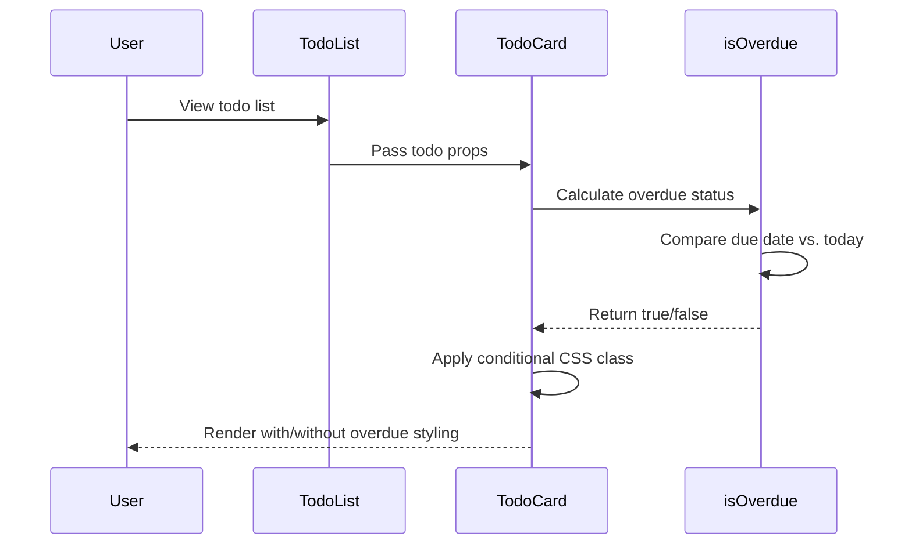
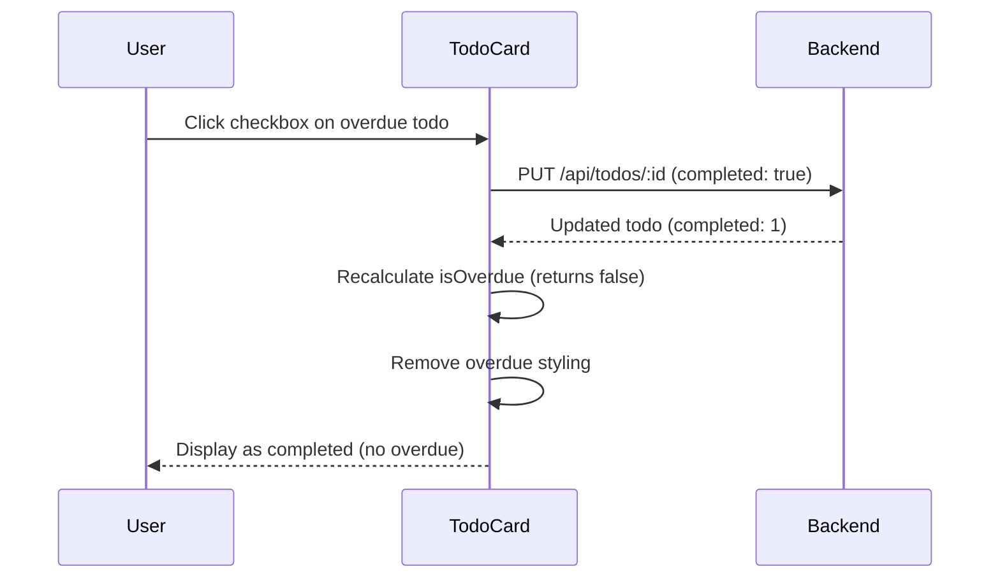
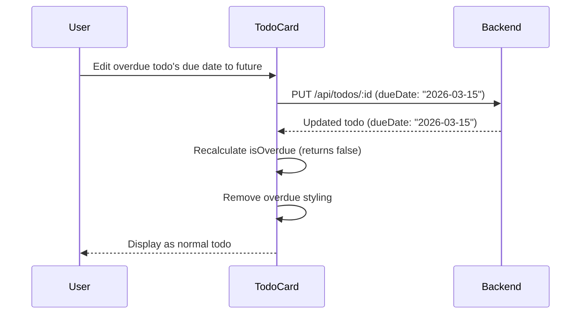

# Data Model: Overdue Todo Items

**Feature**: Overdue Todo Items  
**Date**: February 27, 2026  
**Status**: No new entities or schema changes required

## Overview

This feature introduces **no new data entities** and requires **no database schema changes**. The overdue state is a **computed/derived value** calculated client-side from existing Todo entity fields.

---

## Existing Entities (No Changes)

### Todo (Existing Entity)

**Storage**: SQLite database via better-sqlite3 (backend)  
**Source**: `packages/backend/src/services/todoService.js`

#### Fields

| Field | Type | Nullable | Description | Validation |
|-------|------|----------|-------------|------------|
| `id` | INTEGER | No | Primary key, auto-increment | Unique, positive integer |
| `title` | TEXT | No | Todo item description | 1-255 characters, non-empty after trim |
| `completed` | BOOLEAN | No | Completion status (0=false, 1=true) | 0 or 1 |
| `dueDate` | TEXT | Yes | ISO 8601 date string (YYYY-MM-DD) | Valid ISO date or NULL |
| `createdAt` | TEXT | No | ISO 8601 timestamp of creation | Auto-generated on insert |

**Existing Relationships**: None (single-user, flat todo list)

**Notes**:
- `dueDate` field already exists and is used by this feature (no schema change needed)
- `completed` field already exists and determines overdue eligibility
- Backend API already exposes these fields via GET /api/todos and PUT /api/todos/:id

---

## Computed State (Client-Side Only)

### OverdueStatus (Derived Value)

**Purpose**: Determine if a todo should display overdue styling  
**Computation Location**: Frontend (`packages/frontend/src/components/TodoCard.js`)  
**Storage**: Not persisted; calculated on-demand during rendering

#### Computation Logic

```javascript
function isOverdue(todo) {
  // Not overdue if: no due date, already completed, or future/today date
  if (!todo.dueDate || todo.completed) {
    return false;
  }
  
  // Compare dates at day level (ignore time)
  const today = new Date();
  today.setHours(0, 0, 0, 0);
  
  const due = new Date(todo.dueDate);
  due.setHours(0, 0, 0, 0);
  
  // Overdue if due date is strictly before today
  return due < today;
}
```

#### Inputs
- `todo.dueDate` (TEXT, nullable): ISO date string from database
- `todo.completed` (BOOLEAN): Completion status from database
- Current date (from client system clock)

#### Output
- Boolean: `true` if overdue, `false` otherwise

#### State Transitions

```
NULL dueDate → NOT overdue (no date = can't be late)
Future date → NOT overdue (not yet due)
Today's date → NOT overdue (today is not late)
Past date + incomplete → OVERDUE (late and not done)
Past date + completed → NOT overdue (completed tasks never overdue)
```

**Edge Cases Handled**:
- Invalid date strings: `new Date(invalid)` returns Invalid Date, comparison returns false (safe default)
- Timezone differences: Uses client local time consistently for "today" and "due date"
- Date-only values (no time): Normalized to midnight before comparison
- Completed overdue todos: Never show as overdue per business rules

---

## Validation Rules (Unchanged)

All validation rules remain the same as existing Todo entity:

### Title Validation (Backend)
- **Required**: Non-empty after trimming whitespace
- **Max Length**: 255 characters
- **Error**: 400 Bad Request with message "Title is required" or "Title too long"

### Due Date Validation (Backend)
- **Format**: ISO 8601 date string (YYYY-MM-DD) or NULL
- **Range**: Any valid date (past, present, or future allowed)
- **Error**: 400 Bad Request with message "Invalid due date format"

### Completed Validation (Backend)
- **Type**: Boolean (stored as 0 or 1 in SQLite)
- **Default**: 0 (false) on creation

---

## Data Flow

### Display Overdue Todo



### Toggle Completion (Overdue → Completed)



### Update Due Date (Overdue → Future Date)



---

## API Contract (Unchanged)

No API changes required. Existing endpoints already support all necessary fields:

### GET /api/todos
**Response**: Array of todos with `id`, `title`, `completed`, `dueDate`, `createdAt`

### PUT /api/todos/:id
**Request Body**: `{ title, completed, dueDate }`  
**Response**: Updated todo object

---

## Schema Migration

**No migration required.** The `dueDate` and `completed` columns already exist in the todos table.

---

## Testing Implications

### Unit Test Data

Test todos should include various combinations for overdue scenarios:

```javascript
const testTodos = [
  { id: 1, title: 'Overdue incomplete', dueDate: '2026-02-20', completed: false }, // Overdue
  { id: 2, title: 'Overdue but completed', dueDate: '2026-02-20', completed: true }, // Not overdue
  { id: 3, title: 'Due today', dueDate: '2026-02-27', completed: false }, // Not overdue
  { id: 4, title: 'Due tomorrow', dueDate: '2026-02-28', completed: false }, // Not overdue
  { id: 5, title: 'No due date', dueDate: null, completed: false }, // Not overdue
  { id: 6, title: 'Way overdue', dueDate: '2026-01-15', completed: false }, // Overdue (>7 days)
];
```

### Mock Data Requirements

Tests must mock the current date using `jest.setSystemTime()` to ensure deterministic overdue calculations.

---

## Summary

- ✅ **No database changes** required
- ✅ **No new entities** introduced
- ✅ **No API contract changes** needed
- ✅ **Computed state** only (client-side calculation)
- ✅ Uses existing `dueDate` and `completed` fields from Todo entity
- ✅ Backward compatible (all existing todos work without modification)
